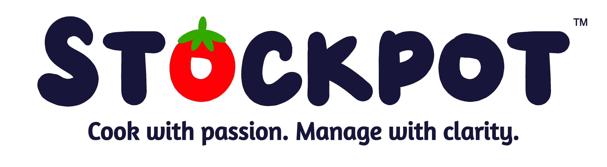

<p align="center">
  
</p>

---

Stockpot is an AI-powered food cost and purchasing platform built specifically for independent restaurants. It gives small and family-owned operators the tools that big chains have always had — without the complexity, the cost, or the learning curve.

Meet **Nonna** — Stockpot's built-in AI assistant. She watches your numbers, alerts you when something's wrong, and gives you plain-language advice in your language, on your schedule.

---

## What Stockpot does

| Feature | Description |
|---|---|
| **Menu & Recipe Builder** | Photo upload extracts your menu automatically. Food cost and margins calculated per dish. |
| **Smart Purchasing** | Weekly order list generated from your sales history. Learns your rhythm over time. |
| **Waste Tracking** | 60-second end-of-shift waste log. Nonna surfaces the patterns. |
| **Inventory & Barcode Scanning** | Phone camera scans barcodes during counts. No extra hardware needed. |
| **Invoice Scanning** | Snap a supplier invoice — ingredient costs update automatically. |
| **Vendor Management** | Supplier contacts, order history, price trend tracking. |
| **Allergen Tracking** | Auto-generated per dish from recipe ingredients. |
| **Exportable Reports** | One-click PDF and CSV for your accountant. |
| **Multi-Language Support** | Full UI and Nonna in English, Spanish, Vietnamese, Mandarin, Korean, Greek, Italian. |
| **POS Integration** | Square, Toast, and Clover sync — or manual entry for old-school operators. |
| **Supplier Benchmarking** | Nonna compares your ingredient costs to anonymized regional averages. |
| **Seasonal Awareness** | Nonna adjusts purchasing recommendations around holidays and local events. |

---

## Nonna 🍅

Nonna is Stockpot's AI assistant — powered by Claude. She's not a chatbot you have to dig into. She comes to you when something matters.

- *"Your food cost hit 38% today. Your target is 32%. Want me to look at what changed?"*
- *"You're paying $4.20/lb for chicken thighs. Most restaurants in your area pay $3.80."*
- *"Mother's Day is in 10 days — your busiest day last year. Here's what to order differently."*
- *"You waste an average of 8lbs of salmon per week. At your cost that's $2,400/year."*

Available in the free tier. Gets smarter as you connect more data sources.

---

## Pricing

| Plan | Price | Includes |
|---|---|---|
| **Free** | $0 | 1 location, 20 menu items, basic food cost calculator, Nonna (limited data) |
| **Pro** | $29/month | Unlimited everything, POS sync, invoice scanning, barcode scanning, full Nonna |

---

## Tech stack

<p align="center">
  
  
  
  
  
  
</p>

---

## Project status

| Layer | Status |
|---|---|
| Backend — FastAPI | 🔧 In Progress |
| Database — Supabase/PostgreSQL | ✅ Complete |
| Auth — Register, Login, JWT | ✅ Complete |
| Menu & Recipe Builder | 🔧 In Progress |
| Smart Purchasing | Planned |
| Waste Tracking | Planned |
| Nonna AI | Planned |
| React Frontend | Planned |
| Mobile — Capacitor | Planned |

---

## Getting started

```cmd
git clone https://github.com/JMitchTech/stockpot.git
cd stockpot
python -m venv venv
venv\Scripts\activate
pip install -r requirements.txt
copy .env.template .env
```

Fill in your keys in `.env` then run:

```cmd
uvicorn api.main:app --reload --port 8000
```

API docs available at `http://localhost:8000/docs`

---

<p align="center">
  <sub>Built by <a href="https://github.com/JMitchTech">JMitchTech</a> · Part of the Wizardwerks Enterprise Labs ecosystem</sub>
</p>